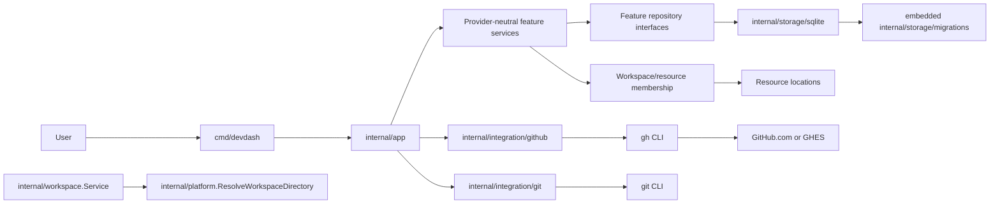

# Architecture

## Current system

Devdash is a local Go CLI backed by SQLite. The current executable dispatches commands in `cmd/devdash` and composes behavior in `internal/app`. Implemented services cover workspaces, workspace configuration, resources and memberships, resource and relation type registries, secrets, and GitHub-backed repository discovery and cloning.

Alias operations and relation-edge CRUD or traversal are not exposed. Jira and Confluence integration directories are placeholders only.

## Core concepts

| Concept | Meaning | Current support |
| --- | --- | --- |
| Workspace | Named local project context with an opaque ID and local root. | CRUD, configuration, resource membership, GitHub setup/check |
| Resource | Provider-neutral logical identity for anything in project context. | CRUD and GitHub repository mapping |
| Resource Type | Registered vocabulary for resource kinds. | List, show, register |
| Resource Location | Physical instance of a resource, optionally owned by a workspace. | Repository checkout registration; arbitrary CRUD is schema-only |
| Alias | Human-facing resource name, global or workspace-scoped. | Schema/design concept; operations are not implemented |
| Relation | Directed typed edge between two resources. | Schema/design concept; edge operations and traversal are not implemented |
| Relation Type | Registered relation vocabulary, including inverse metadata and symmetry. | List, show, register |
| Integration | Configured provider instance associated with provider-backed resources. | GitHub repository mapping; general integration CRUD is not exposed |
| Workspace Config | Namespaced string values owned by a workspace. | List, get, set, unset, edit, and integration resolution |
| Secret | Named sensitive value stored in SQLite. | Set, get, masked show, list, delete |

## System flow

The direct `internal/workspace.Service -> internal/platform.ResolveWorkspaceDirectory` path is current behavior. It is shown explicitly rather than claiming stricter layering than the implementation has.

## Package boundaries

Intended dependency direction:

- `cmd/devdash` stays thin and delegates execution.
- `internal/app` owns command dispatch, composition, and use-case orchestration.
- Provider-neutral feature packages such as `workspace`, `resource`, `repository`, `graph`, `secret`, `config`, and `configdef` own behavior and boundary interfaces.
- `internal/integration/*`, `internal/platform`, and `internal/storage` implement external and infrastructure boundaries.
- `internal/storage/migrations` embeds the numbered Goose migrations used by the SQLite adapter.

Dependencies are passed explicitly. SQLite is an adapter, not the domain model. Core packages must not depend on provider-specific names unless the concept is universal.

## Provider boundaries

GitHub is the only implemented provider workflow. It resolves effective workspace configuration, runs `gh` for authentication, owner and repository discovery, and cloning, then maps results into provider-neutral resources. GitHub Enterprise receives process-local command configuration rather than global `gh` changes.

Local checkout validation executes targeted `git` commands against registered paths or exact clone destinations. Devdash does not discover repositories by scanning workspace directories.

Provider clients belong under `internal/integration/<provider>`. Provider-neutral orchestration and models remain outside those adapters.

## Persistence boundary

Feature services depend on repository interfaces. `internal/storage/sqlite` implements those interfaces with transactions, foreign keys, explicit timestamp updates, and embedded migrations. Physical workspace directories and checkouts are not database contents.

The universal identity is `resources.id`. Workspace membership and physical locations are separate records, allowing one logical resource to belong to multiple workspaces and have distinct physical instances.

## Current and planned capabilities

**Current:** workspace lifecycle and configuration; resource, resource-type, relation-type, membership, and secret persistence; GitHub configuration, discovery, repository mapping, state inspection, and conservative clone behavior.

**Planned:** alias registration and deterministic resolution; relation-edge CRUD and traversal; Jira and Confluence provider behavior; tags and general location/integration operations. Schema presence does not imply service or CLI support.

## Related documentation

- [Data Model](data-model.md)
- [Database](database.md)
- [Extension Guide](extension-guide.md)
- [Roadmap](roadmap.md)
- [ADR 0001: Use Go](adr/0001-use-go.md)
- [ADR 0002: Use SQLite](adr/0002-use-sqlite.md)
- [ADR 0003: Universal Resource Model](adr/0003-universal-resource-model.md)
- [ADR 0004: Workspace Configuration](adr/0004-workspace-config.md)
- [ADR 0005: Reserved Internal Configuration](adr/0005-reserved-internal-config.md)
- [ADR 0006: Use GitHub CLI Integration](adr/0006-github-cli-integration.md)
