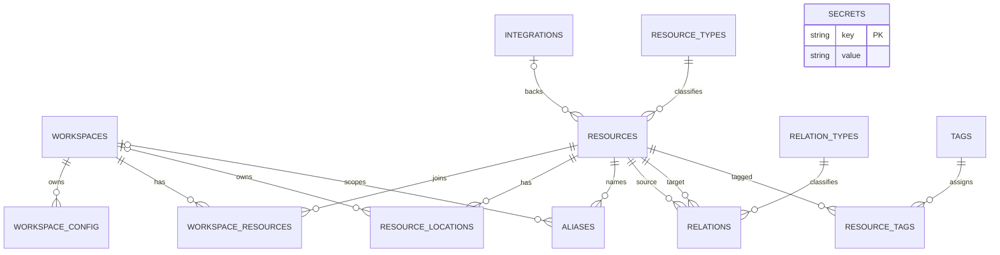

# Data Model

SQLite stores a provider-neutral resource graph. Schema support and application behavior are distinct: a table may exist before a service or CLI exposes it.

## Capability status

Implemented persistence covers workspaces, workspace configuration, resource types, relation types, resources, workspace membership, secrets, and the GitHub repository mapping into integrations, resources, memberships, and checkout locations.

Schema-only behavior currently includes alias operations and resolution, relation rows and traversal, tags and resource tags, arbitrary resource-location CRUD, and general integration CRUD. `secrets` is implemented by migration `00003_add_secrets.sql`; workspace configuration is added by `00004_add_workspace_config.sql`.

## Tables

### `workspaces`

- **Purpose:** named local project contexts.
- **Load-bearing columns:** opaque `id`, unique `name`, optional `local_path`, optional JSON `metadata`, timestamps.
- **Owner/scope:** top-level local registry record.
- **Foreign keys/delete behavior:** deleting a workspace cascades its config, memberships, workspace-owned locations, and workspace-scoped aliases; resources themselves remain.
- **Uniqueness:** `name` is globally unique.

### `workspace_config`

- **Purpose:** normalized namespaced string configuration per workspace.
- **Load-bearing columns:** `workspace_id`, `namespace`, `key`, `value`, timestamps.
- **Owner/scope:** one workspace.
- **Foreign keys/delete behavior:** `workspace_id` references `workspaces(id) ON DELETE CASCADE`.
- **Uniqueness:** primary key `(workspace_id, namespace, key)`.

### `integrations`

- **Purpose:** configured provider instances used to identify provider-backed resources.
- **Load-bearing columns:** opaque `id`, `provider`, `name`, `base_url`, credential reference, JSON config, enabled flag, timestamps.
- **Owner/scope:** provider instance; general CRUD is schema-only, while GitHub repository refresh upserts one.
- **Foreign keys/delete behavior:** deleting an integration sets referencing `resources.integration_id` to `NULL`.
- **Uniqueness:** `(provider, name)`.

### `resource_types`

- **Purpose:** registry of stable resource-kind names.
- **Load-bearing columns:** primary-key `name`, `display_name`, owner, description.
- **Owner/scope:** global vocabulary.
- **Foreign keys/delete behavior:** `resources.type` uses the default restrictive foreign-key behavior, so a referenced type cannot be removed.
- **Uniqueness:** `name`.

### `resources`

- **Purpose:** universal provider-neutral logical identity.
- **Load-bearing columns:** opaque `id`, registered `type`, optional `integration_id`, immutable provider `provider_id` when available, human-readable `external_key`, name, URL, JSON metadata, timestamps, `last_seen_at`.
- **Owner/scope:** independent of workspaces; one resource may have many workspace memberships.
- **Foreign keys/delete behavior:** type is restrictive; integration deletion sets `integration_id` to `NULL`; resource deletion cascades memberships, locations, aliases, source/target relation rows, and resource tags.
- **Uniqueness:** partial unique `(integration_id, type, provider_id)` where `provider_id IS NOT NULL`.

### `workspace_resources`

- **Purpose:** many-to-many workspace/resource membership with optional role.
- **Load-bearing columns:** `workspace_id`, `resource_id`, role, JSON metadata, creation time.
- **Owner/scope:** one workspace-resource pair.
- **Foreign keys/delete behavior:** both workspace and resource references cascade.
- **Uniqueness:** primary key `(workspace_id, resource_id)`.

### `resource_locations`

- **Purpose:** physical instances separate from logical resource identity.
- **Load-bearing columns:** opaque `id`, `resource_id`, optional `workspace_id`, `location_type`, `path`, JSON metadata, timestamps.
- **Owner/scope:** always one resource; optionally one workspace. Repository checkouts use `location_type = 'local_checkout'`.
- **Foreign keys/delete behavior:** deleting the resource or optional owning workspace cascades the row.
- **Uniqueness:** `(location_type, path)` is globally unique, not merely workspace-local.

### `aliases`

- **Purpose:** human-facing names, either global or workspace-scoped.
- **Load-bearing columns:** opaque `id`, `name`, optional `workspace_id`, `resource_id`, `is_primary`, JSON metadata, timestamps.
- **Owner/scope:** `workspace_id IS NULL` is global; otherwise scoped to one workspace. Operations are schema-only.
- **Foreign keys/delete behavior:** workspace-scoped aliases cascade with the workspace; every alias cascades with its resource.
- **Uniqueness:** alias name is unique within a workspace and global alias name is unique globally. At most one primary alias exists for each resource and workspace scope, plus at most one global primary alias.

### `relation_types`

- **Purpose:** registry for directed relation semantics, inverse names, and symmetry metadata.
- **Load-bearing columns:** primary-key `name`, display name, optional inverse name, symmetric flag, owner, description.
- **Owner/scope:** global vocabulary.
- **Foreign keys/delete behavior:** `relations.relation_type` uses default restrictive behavior.
- **Uniqueness:** `name`.

### `relations`

- **Purpose:** directed typed edges between resources. Edge CRUD and traversal are not implemented.
- **Load-bearing columns:** opaque `id`, `source_id`, `target_id`, `relation_type`, JSON metadata, timestamps.
- **Owner/scope:** one directed edge.
- **Foreign keys/delete behavior:** source and target resource deletion cascade; the type registry reference is restrictive.
- **Uniqueness/constraints:** no self-edge; unique `(source_id, target_id, relation_type)`. Inverse metadata does not create an inverse row automatically.

### `tags`

- **Purpose:** global tag vocabulary. Application operations are not implemented.
- **Load-bearing columns:** opaque `id`, unique `name`, description, creation time.
- **Owner/scope:** global.
- **Foreign keys/delete behavior:** deleting a tag cascades its `resource_tags` rows.
- **Uniqueness:** `name`.

### `resource_tags`

- **Purpose:** many-to-many resource/tag membership. Application operations are not implemented.
- **Load-bearing columns:** `resource_id`, `tag_id`, creation time.
- **Owner/scope:** one resource-tag pair.
- **Foreign keys/delete behavior:** both resource and tag references cascade.
- **Uniqueness:** primary key `(resource_id, tag_id)`.

### `secrets`

- **Purpose:** named sensitive values used through the secret service.
- **Load-bearing columns:** primary-key `key`, application-readable `value`, optional description, timestamps.
- **Owner/scope:** standalone local registry state, not workspace-scoped.
- **Foreign keys/delete behavior:** none.
- **Uniqueness:** `key`.

## Relationships

Only schema-backed relationships appear here. The diagram does not imply that every relationship has service or CLI support.

## Universal resource identity

`resources.id` is the logical identity used by provider-neutral services. `provider_id` retains stable provider identity when available, while `external_key` retains its human-readable provider name. The two must not be substituted for the opaque resource ID.

`workspace_resources` separates membership from identity, so the same resource can belong to multiple workspaces. `resource_locations` separates physical instances such as checkouts from the logical resource.

Alias scope is enforced by partial unique indexes: names are unique within their workspace or the global scope, and only one primary alias exists per resource and scope. Alias resolution is not implemented.

Relations are directed. A source, target, and relation type can appear only once, self-edges are forbidden, and inverse or symmetric metadata never silently creates another row. Relation-edge CRUD and traversal are not implemented.
